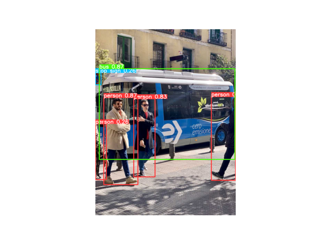

# 📘 Pelatihan Computer Vision dengan Python, OpenCV, TensorFlow, YOLO, dan Google Colab

Repositori ini berisi kumpulan **notebook pelatihan Computer Vision** berbasis Python, OpenCV, TensorFlow, dan YOLO.  
Materi disusun bertahap mulai dari dasar hingga studi kasus implementasi dunia nyata seperti **deteksi kebakaran** dan **analisa kerutan wajah**.

📌 **Repo GitHub:** [edisuwoto/yoloai](https://github.com/edisuwoto/yoloai)

---

## 📂 Struktur Modul

### **Module 1: Dasar Computer Vision**
- Apa itu Computer Vision?
- Pengenalan citra digital (RGB, Grayscale, dll.)
- Operasi dasar gambar: cropping, resizing, filtering
- Visualisasi dengan Matplotlib & OpenCV

### **Module 2: Pengenalan YOLO (You Only Look Once)**
- Arsitektur YOLO
- Perbandingan YOLOv3, YOLOv4, YOLOv5, YOLOv8
- Demo inference dengan model pre-trained

### **Module 3: Persiapan Dataset**
- Labeling data dengan LabelImg/Roboflow
- Augmentasi data
- Struktur folder untuk training YOLO

### **Module 4: Training Model YOLO**
- Konfigurasi hyperparameter
- Transfer learning
- Training di Google Colab / GPU lokal

### **Module 5: Evaluasi Model**
- mAP (Mean Average Precision)
- Precision-Recall Curve
- Confusion Matrix

### **Module 6: Optimisasi & Deployment**
- Konversi model ke ONNX / TensorRT
- Optimasi inference speed
- Deployment ke server / edge device

### **Module 7: Feature Maching and Object Training**
- Feature Matching Techniques (SIFT, SURF, ORB)
- Object Tracking basics
- Object Tracking with Kalman Filters
- Multi-object Tracking

### **Module 8: Studi Kasus 2 — Deteksi Kerutan Wajah & Analisa Usia**
- Dataset kerutan wajah & age prediction
- YOLO untuk deteksi wajah
- CNN tambahan untuk klasifikasi kerutan & usia

---

## 🎯 Demo: Deteksi Kerutan Wajah & Analisa Usia

Notebook ini memanfaatkan:
- **YOLO** → mendeteksi area wajah  
- **CNN tambahan** → menganalisa tingkat kerutan & memprediksi usia  

**Contoh Output:**
- Bounding box wajah
- Label prediksi: `Wrinkle Level: Medium, Age: 32-38`

---

## 🚀 Cara Menjalankan di Google Colab

1. **Klik link modul** sesuai topik:
   - [Module 1 — Intro Computer Vision](https://colab.research.google.com/github/edisuwoto/yoloai/blob/main/Module_1_Intro_Computer_Vision.ipynb)  
   - [Module 2 — Basic Image Operations](https://colab.research.google.com/github/edisuwoto/yoloai/blob/main/Module_2_Basic_Image_Operations.ipynb)  
   - [Module 3 — Filtering & Edge Detection](https://colab.research.google.com/github/edisuwoto/yoloai/blob/main/Module_3_Filtering_Edge_Detection.ipynb)  
   - [Module 4 — Haar Cascade Detection](https://colab.research.google.com/github/edisuwoto/yoloai/blob/main/Module_4_Haar_Cascade_Detection.ipynb)  
   - [Module 5 — Intro YOLO](https://colab.research.google.com/github/edisuwoto/yoloai/blob/main/Module_5_Intro_YOLO.ipynb)  
   - [Module 6 — Train YOLO Custom Dataset](https://colab.research.google.com/github/edisuwoto/yoloai/blob/main/Module_6_Train_YOLO_Custom_Dataset.ipynb)  
   - [Module 7 — Test & Evaluate YOLO](https://colab.research.google.com/github/edisuwoto/yoloai/blob/main/Module_7_Test_Evaluate_YOLO.ipynb)  
   - [Module 8 — Wrinkle Detection & Age Analysis](https://colab.research.google.com/github/edisuwoto/yoloai/blob/main/module8_wrinkle_age.ipynb)  
   - [Module 8 — Demo](https://colab.research.google.com/github/edisuwoto/yoloai/blob/main/module8_demo.ipynb)  
   - [Module 8 — Demo 1](https://colab.research.google.com/github/edisuwoto/yoloai/blob/main/module8_demo1.ipynb)  

2. Klik **Copy to Drive** untuk menyimpan ke Google Drive.  
3. Jalankan sel kode dari atas ke bawah.

---
## 📸 Hasil Deteksi YOLO

Berikut contoh hasil deteksi pada modul pelatihan:

### 1. Deteksi Objek Umum (COCO dataset)


### 2. Deteksi Objek Banjir
<video width="500" controls>
  <source src="demo/flood_detection_output.mp4" type="video/mp4">
  Your browser does not support the video tag.
</video>

### 3. Deteksi Kebakaran
<video width="500" controls>
  <source src="demo/fire_output.mp4" type="video/mp4">
  Your browser does not support the video tag.
</video>
---
## 💻 Instalasi Lokal

Jika ingin dijalankan di laptop dengan Python:

```bash
git clone https://github.com/edisuwoto/yoloai.git
cd yoloai
pip install -r requirements.txt

## menjalankan di mac os
# Buka terminal
python3.10 -m venv yolo_env
source yolo_env/bin/activate
# Aktifkan dulu env
source yolo_env/bin/activate  

# Install tensorflow (khusus MacOS ARM pakai tensorflow-macos)
pip install tensorflow-macos

# Jika butuh support GPU Metal (lebih cepat di Mac M1/M2/M3)
pip install tensorflow-metal

pip install --upgrade pip
pip install ultralytics opencv-python matplotlib

pip uninstall opencv-python -y
pip install opencv-contrib-python
